# 医院预约挂号管理系统

> 可用于毕业设计参考或者个人学习

## 系统用户按权限分为三种，即管理员，医生，患者。不同的用户拥有不同的权限，各自完成各自的功能，不同的用户看到不同的系统功能。

### 管理员：
1. 	登录功能：通过前台验证用户密码后可以登录。
2. 	科室信息管理：可以对医院的科室进行维护管理。
3. 	诊室信息管理：可以对诊室进行维护管理。
4.  号源信息管理：可以对医生的号源进行审查通过管理等。
5. 	排班信息管理：可以对排班进行维护管理。
6. 	留言信息管理：可以对患者留言进行维护管理。
7. 	修改个人密码功能。
8.  等等...
### 医生：
1. 	登录功能
2. 	基本信息查询：可以对本人信息、进行查询修改。
3. 	出诊申请：可以像管理员申请出诊听诊的信息。
4. 	患者队列：可以对患者队列进行管理。
5. 	患者病例管理：可以对患者病例进行管理。
### 患者：
1. 	登录功能
2. 	基本信息查询：可以对本人信息、进行查询修改。
3. 	挂号管理：可以按照科室，诊室，医生进行挂号。
4. 	预约：可以查看我的预约。
5. 	留言：可以对医院进行留言并且可看到所有人的留言。

### 技术要求	
1. Servlet+Jsp+Jdbc+dbutils+EasyUI+jQuery+Ajax+面向接口编程；
2. 使用SQL Server或MySQL作为后台数据库，依据数据库设计过程及规范，设计数据库表结构及主外键关系，并结合功能需求适当设计存储过程和触发器；
3. 采用面向对象设计方法学，运用所学的面向对象分析设计方法，以及对应的工具对系统进行分析与设计建模；
4. 基于模块化编程思想，程序源文件应划分为相应package，组织层次清晰；
5. 遵循程序设计编码规范，标识符应命名规范、代码注释充分、排版风格良好；

### 部分系统截图

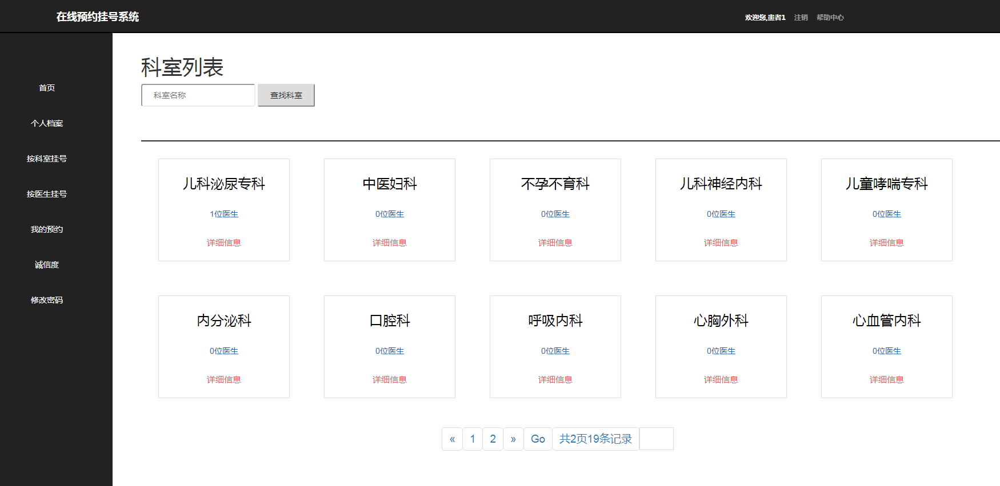

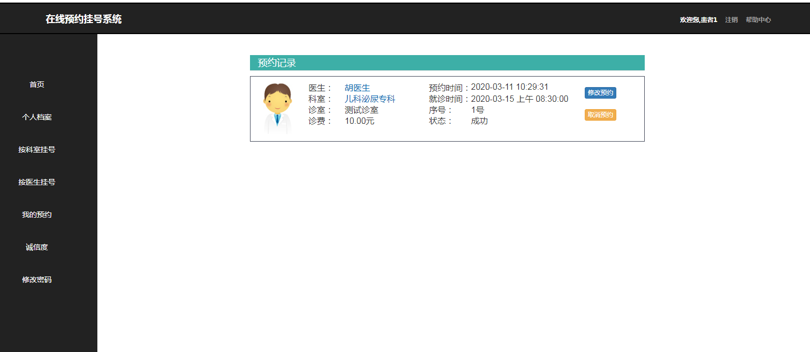

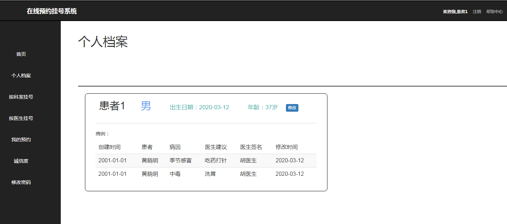

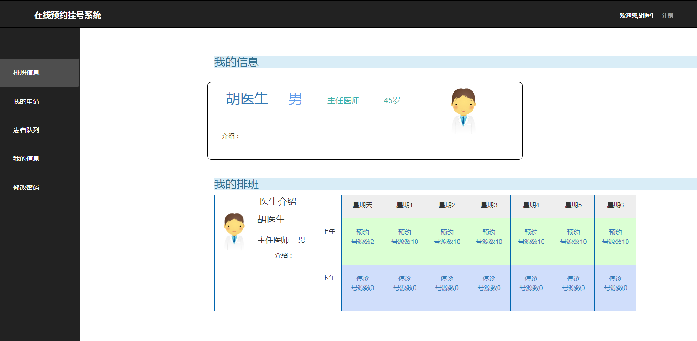

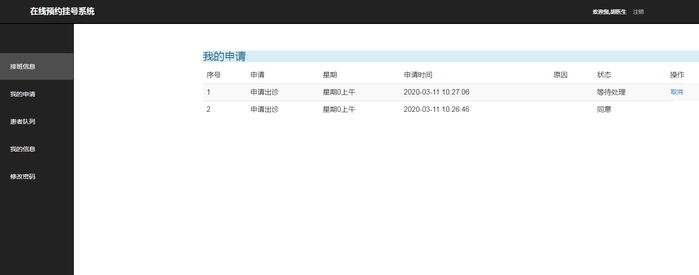

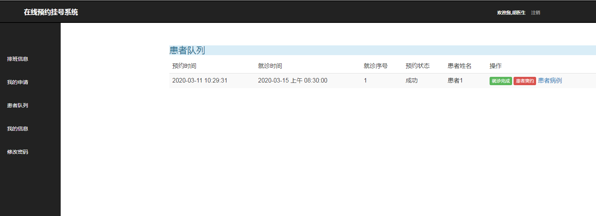

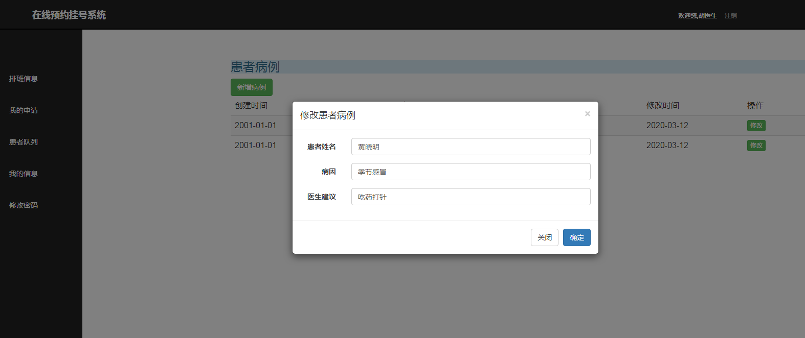

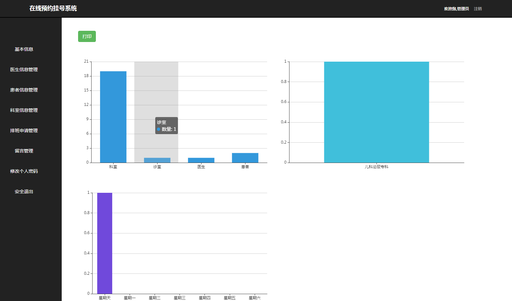

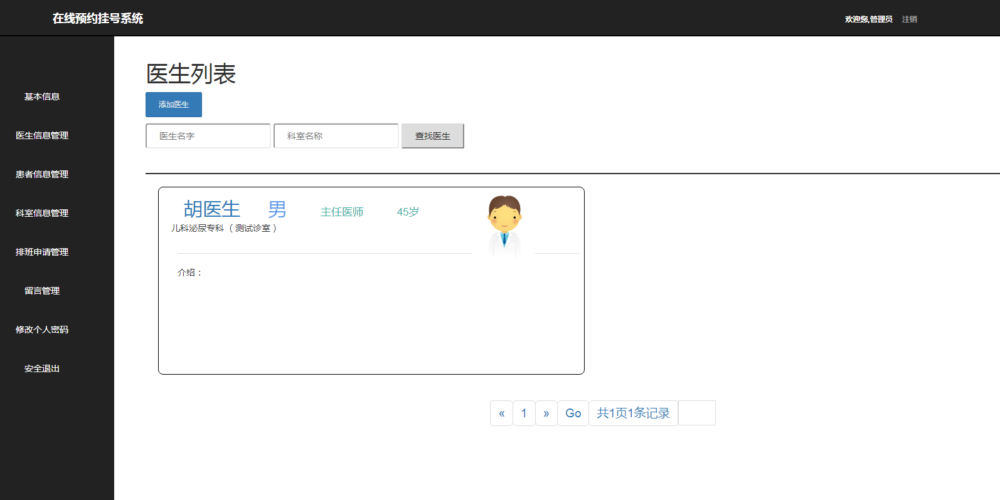

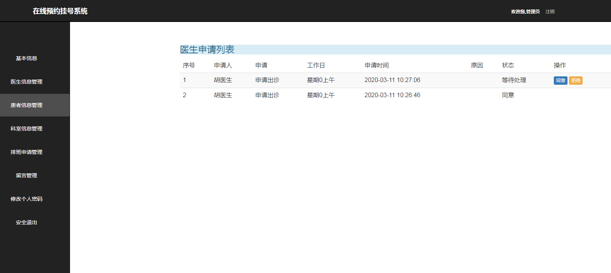

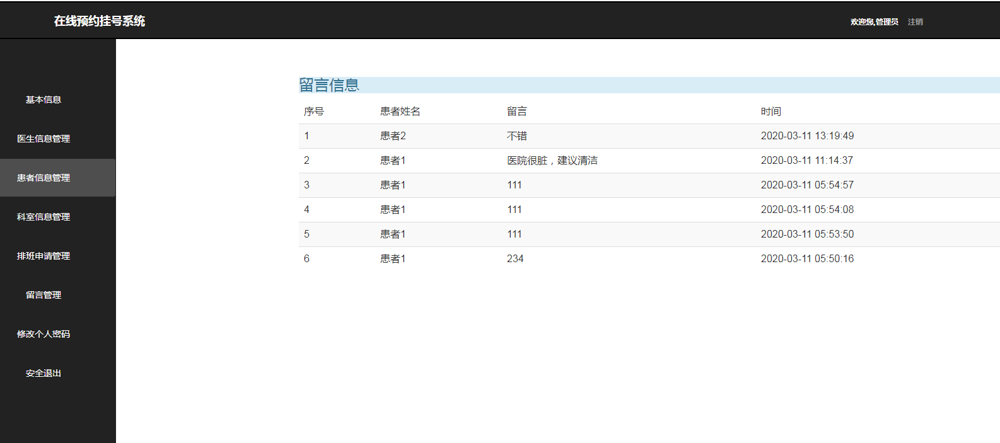
# 源码完整版 可加qq：625285133 咨询获取，可一对一专业指定需求，个性化制定代码。
# 后续持续更新新系统，敬请期待！
